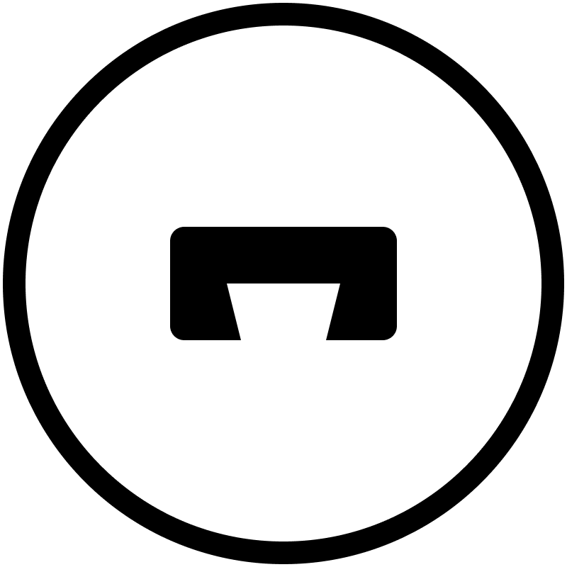

## Blog3
Blog3 is blog platfrom for Web3, that's the name come from. But Blog is not limited in blog, it could the next generation content sharing platform, which aims give back the ownership to both author and readers, covering blog, novel, and any other digital contents form. 

Since 2024/09/01

## Background

In the current market, there are typical traditional blog platform e.g Medium and crypto blog platform e.g. Mirror. 

There are fierce competition among traditional blog platform, and some content creators have to migrate or operate differnet platform. Because the traffic change quickly among different platform.

For crypto blog platform, it's still target to a small group of user, which limit the user base. And it usually have limit monetization way for content creators.

## Problem to be Solved

As mentioned above, there are lots of issues need to be resolved. 

1. Centralized platform control and host the content itself, literaly, creators can't control the asset they should own
2. Currently lots of centralized content platform get most of the ads revenue, and distribute only part of them to creators
3. Readers usually the consumer in general platform, they can't get paid with attention and sharing contribution

## Project Overview

Blog3 here to revolution the content platform

1. **Give back the ownership**: we would give back the ownership to content creator, and under subsription mode, only creator could subsribed readers and creator could see the content. Management of the storage is also under creators.
2. **Sharing the broad revenue**: we pre-set the bonding curve to make sure the sharing percentage between both content creator and platform is settled, and ensure creator could get most of the reveune they deserved. 
3. **Contribution means ownership**: we regard readers' tip to content as the contribution, and let readers share the revenue from the content as well once the tip hit the bonding curve. 

## Project Demonstration

### **Basic Features**

we would support article publishment, subscription, and tip these basic functions, which similar as other blog platform. There is no entry barrier for creators, for example, creator could set the articles to be public / subscribed, and only subscribers could read the certain articles. And users could also set the subscription fee, in monthly, quarterly or yearly, 

### **Tip Bonding Curve** 
Tip bonding curve is the innovative mechanism first proposed by blog3. Under Tip Bonding Curve, each tip is regarded as investment into the articles, and 80% shares is open for tippers, and remaining 20% is kept for creator. Once Tip Bonding Curve is achieved, the shares are public, and the whole tips are shared by all tippers and creators. Following tips would also get into the tip pool. 

### **Ads Auctions** 

Tip Bonding Curve is successfully achieved, the article unlock the ads articles, and everyone could bid the Ads slot daily, and auction for next day ends one hour of previous day. the highest bidder get the slot. The Ads revenure go into pool with tips. 

## Technical Architecture

## Team Information

| Name         | Role         | 
| ----------- | ----------- |
| Xin       | Full Stack Engineer |
| Frank         | Product Manager | 

## Selected and Category & Bounty

Category: Open Topic

Bounty: 
- CESS Network
- Moonbeam

## Planned and Completed Code Deliverables during the Hackathon

### Basic Feature
- Login and Logout
  - [ ] Subwallet
  - [ ] Talisman
- Creator
  - [ ] Articles List
  - [ ] Followers List
  - [ ] Markdown Editor
  - [ ] IPFS Uploading
  - [ ] Articles List
  - [ ] Local Draft & Save
  - [ ] Set Article Mode
  - [ ] Set Subscription Fees
  - [ ] 
- Reader
  - [ ] Following list
  - [ ] Article Rendering
  - [ ] Subscription Juding
  - [ ] Tipping

### Tip Bonding Curve

- Bonding Curve
  - [ ] Curve Parameter Setting 
  - [ ] Frontend
  - [ ]   Progress
  - [ ]   Share Price
  - [ ] Shares Ledger
- Tip Pool
  - [ ] Assets Holding vis Multisig
  - [ ] Claim and Burn Mechanism

### Ads Auction

- Ads Slot
  - [ ] Frontend Show
- Auction Contract
  - [ ] Auction Mechanism
  - [ ] Revenue Transfer 

